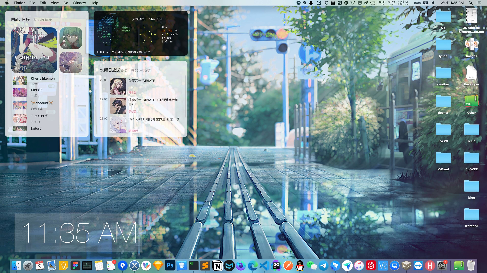
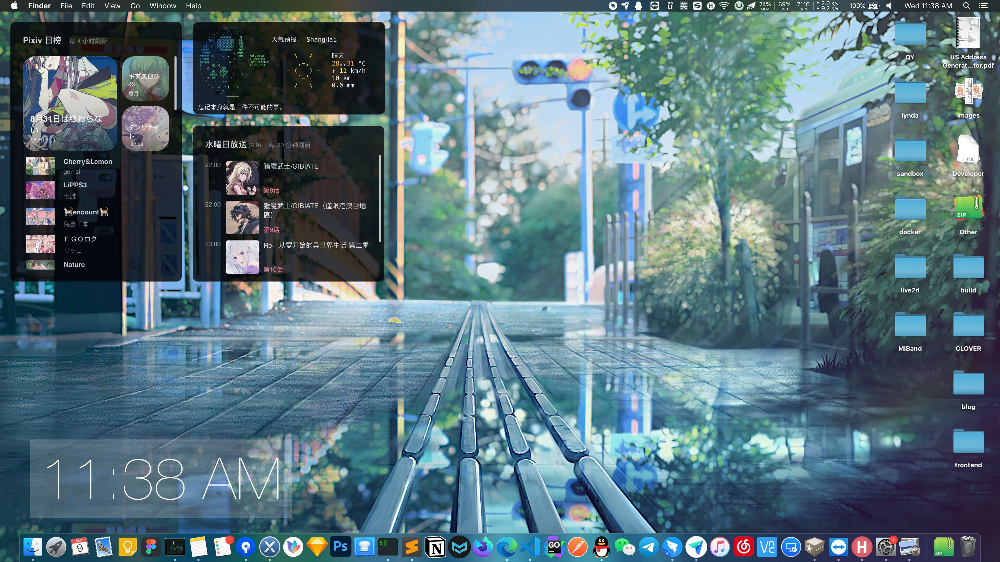

# uebersicht-widget

我用的一些 [Übersicht](https://github.com/felixhageloh/uebersicht) 小部件

## 预览

  

## 目前有这些
- [PixivDaily](widgets/PixivDaily.jsx): Pixiv 排行榜
- [wttr.widget](widgets/wttr.widget): 天气预报、月相
- [BiliBangumi](widgets/BiliBangumi.jsx): Bilibili 新番时间线
